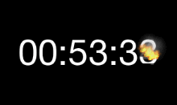
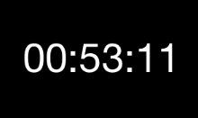
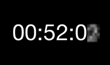
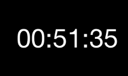
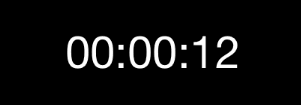

CountdownLabel
========================

[](https://github.com/Carthage/Carthage)
[](http://cocoadocs.org/docsets/CountdownLabel)
[](https://developer.apple.com/swift/)

Simple countdown UIlabel with morphing animation from [LTMorphingLabel](https://github.com/lexrus/LTMorphingLabel), and some useful function.


## features
- Simple creation
- Easily get status of countdown from property and delegate
- Insert some of function, and completion
- Style change as usual as UILabel do
- Morphing animation from [LTMorphingLabel](https://github.com/lexrus/LTMorphingLabel).
- XCTest assertion

## Usage
You need only 2 lines.

```swift
// from current Date, after 30 minutes.
let countdownLabel = SKCountdownLabel(frame: frame, time: 30)
countdownLabel.start()
```

you can set as NSDate too.
```swift
// from current Date, after 30 minutes as NSDate.
let targetDate = NSDate().dateByAddingTimeInterval(30)
let countdownLabel = SKCountdownLabel(frame: frame, targetDate: targetDate)
countdownLabel.start()
```

you can start specified date(NSDate) to endDate.
```swift
// from current Date, after 30 minutes as NSDate.
let fromDate   = NSDate().dateByAddingTimeInterval(10)
let targetDate = fromDate.dateByAddingTimeInterval(30)
let countdownLabel = SKCountdownLabel(frame: frame, fromDate: fromDate, targetDate: targetDate)
countdownLabel.start()
```

#### Morphing example
Set at `animationType`.
Those effect come from [LTMorphingLabel](https://github.com/lexrus/LTMorphingLabel).

```swift
let countdownLabel = SKCountdownLabel(frame: CGRectZero, time: 30)
countdownLabel.animationType = .Pixelate
countdownLabel.start()
```

| morphing effect | example | 
| -------- |--------- | 
| .Burn |   |
| .Evaporate |   |
| .Fall |   |
| .Pixelate |  |   
| .Scale |  |   
| .Sparkle |  |

#### Style
you can directly allocate it as a normal UILabel property just like usual.

```swift
countdownLabel.textColor = .orangeColor()
countdownLabel.font = UIFont.boldSystemFontOfSize(30)
countdownLabel.start(6
```

 

#### Get Status of timer
```swift
timeCounted       // timer has been counted
timetimeRemaining // timer remaining
```

 

#### Control countdown
You can pause, reset, add timer using custom control.

```swift
// check if pause or not
if countdownLabel4.isPaused {
	// timer start
	countdownLabel4.start()
} else {
	// timer pause
    	countdownLabel4.pause()
}
```

```swift
// -2 minutes for ending
@IBAction func minus(countdownLabel: UIButton) {
    countdownLabel.addTimeCountedByTime(-2)
}
    
// +2 minutes for ending
@IBAction func plus(countdownLabel: UIButton) {
    countdownLabel.addTimeCountedByTime(2)
}
```

 

#### Insert Function
Using `then` function or `delegate`, you can set your function anywhere you like.

```swift
countdownLabel.setCountDownTime(30)
countdownLabel.then(10) { [unowned self] in
    self.countdownLabel.textColor = .blueColor()
}
countdownLabel.then(5) { [unowned self] in
    self.countdownLabel.textColor = .yellowColor()
}
countdownLabel.start() {
    self.countdownLabel.textColor = .redColor()
    self.countdownLabel.text = "timer finished."
}
```

 

#### Format
`countdownLabel.timeFormat = @"mm:ss";`


CountdownLabel uses `00:00:00 (HH:mm:ss)` as default format.
if you prefer using another format, Your can set your time format like below.


## Requirements
- iOS 8.0+
- Swift 2.0+
- ARC

##Installation

####CocoaPods
available on CocoaPods. Just add the following to your project Podfile:
```
pod 'CountdownLabel'
use_frameworks!
```

####Carthage
To integrate into your Xcode project using Carthage, specify it in your Cartfile:

```ogdl
github "suzuki-0000/CountdownLabel"
```


## License
available under the MIT license. See the LICENSE file for more info.

